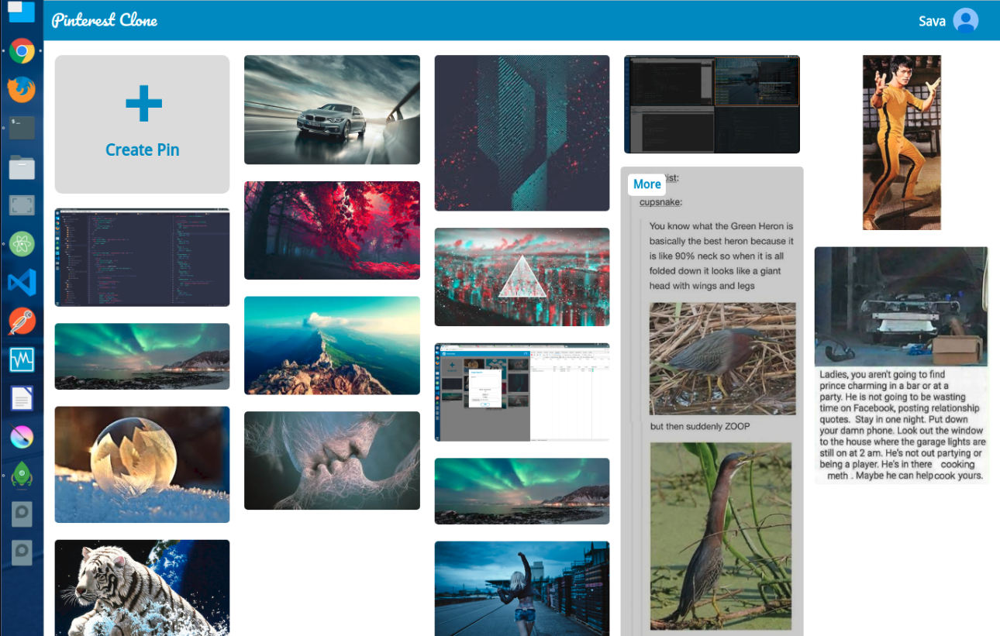

# Pinterest-Clone

The idea for this application came from freeCodeCamp [project](https://www.freecodecamp.org/challenges/build-a-pinterest-clone).
Similar to [Pinterest](https://www.pinterest.com/), It allows users to register an account, or sign in with their Google or Twitter account. Users can also create pins, write comments, and browse other users' walls of images. This is not a production level application, the only purpose of building it was to get familiar with NodeJS and have a lot of fun.

